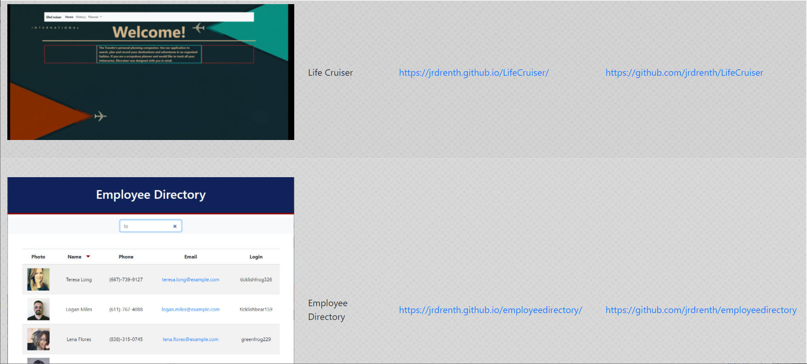

# Employee Directory

## Description

Portfolio showcasing various projects completed.

## Table of Contents 

* [Website](#Website)

* [Usage](#Usage)

* [License](#License)

* [Repository](#Repository)

* [Questions](#Questions)

## Website:

[https://inspiring-boyd-47e31a.netlify.app/](https://inspiring-boyd-47e31a.netlify.app/)

## Usage

Click the `Portfolio` link at the upper right of the website, then follow the various app urls and github links to view apps and their source code.

## License:

This app is licensed under the MIT license.

## Repository:

[https://github.com/jrdrenth/reactportfolio](https://github.com/jrdrenth/reactportfolio)

## Questions:

If you have any questions, please contact me at john.drenth@gmail.com.  My github profile can be found at [https://github.com/jrdrenth/](https://github.com/jrdrenth/).
